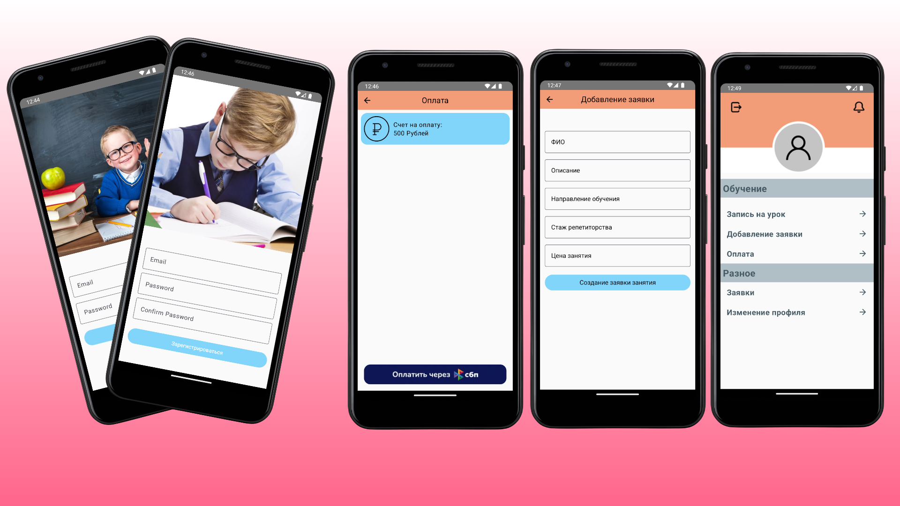
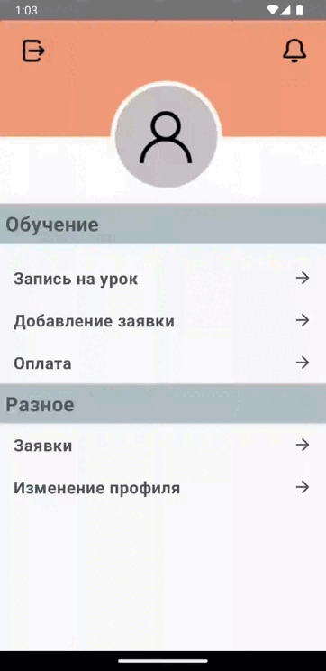

<h1 align="center">AndroidProjectTutoring</h1>

## Technologies
- 100% Kotlin
- Kotlin coroutines
- Kotlin Flows
- Material-Components
  
- Jetpack Compose
  - Lifecycle
  - ViewModel
  - Room: для взаимодействия с БД
  - Hilt: для внедрения зависимостей

- Architecture
  - MVVM Pattern
  - Single Activity
